# Hospital Management System
Hospital Management System using MySQL, Php and Bootstrap

## Prerequisites
1. Install WAMPP web server
2. Any Editor (Preferably VS Code or Sublime Text)
3. Any web browser with latest version

## Languages and Technologies

## Steps to run the project in your machine
1. Download and install WAMPP/XAMPP in your machine
2. Clone or download the repository
3. Extract all the files and move it to the 'WAMPP/www' or 'XAMPP/htdocs'
4. Start the Apache and Mysql in your WAMPP/XAMPP control panel.
5. Open your web browser and type 'localhost/phpmyadmin'
6. In phpmyadmin page, create a new database from the left panel and name it as 'hms'
7. Import the file 'hms.sql' inside your newly created database and click ok.
8. Open a new tab and type 'localhost/hms' in the url of your browser
9. Hurray! That's it!

## GETTING INTO THE PROJECT:
Hospital Management System in php and mysql. This system has a ‘Home’ page from where the patient, doctor & administrator can login into their accounts by toggling the tabs accordingly.

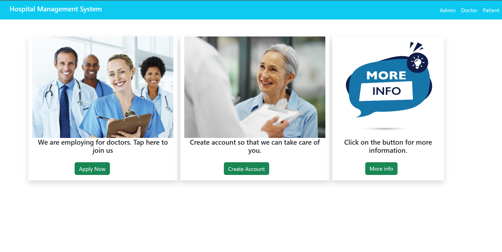

'Apply Now' page allows new doctor to join hospital staff after fill required information.

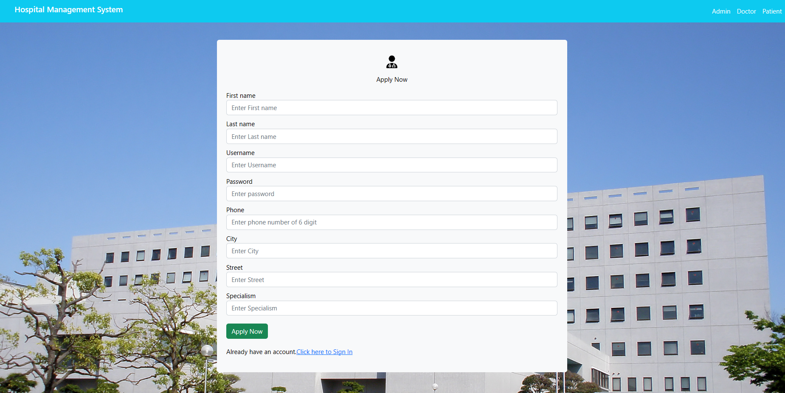

'Create Account' redirect user to page where a new patient make an account to be treated by hospital.

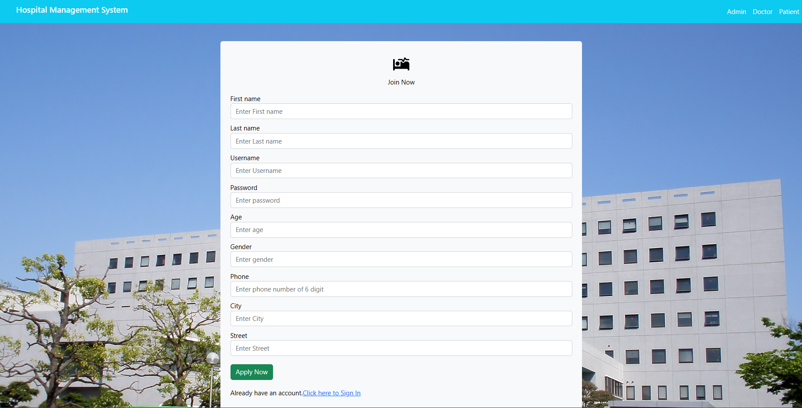

## The ‘Home’ page consists of 3 modules:
1. Admin Module
2. Doctor Module
3. Patient Module

### Admin Module:
   
   &nbsp; &nbsp; &nbsp; This module is the heart of our project where an admin can see the list of all admins, doctors, patients and departments. In addition to the ability to add new or delete existed one. 
    
  &nbsp; &nbsp; &nbsp; Login into admin account can be done by toggling into admin tab of the Home page. Next photo shows the login page for admin.
  &nbsp; &nbsp; &nbsp; `username`: admin, `password`: admin

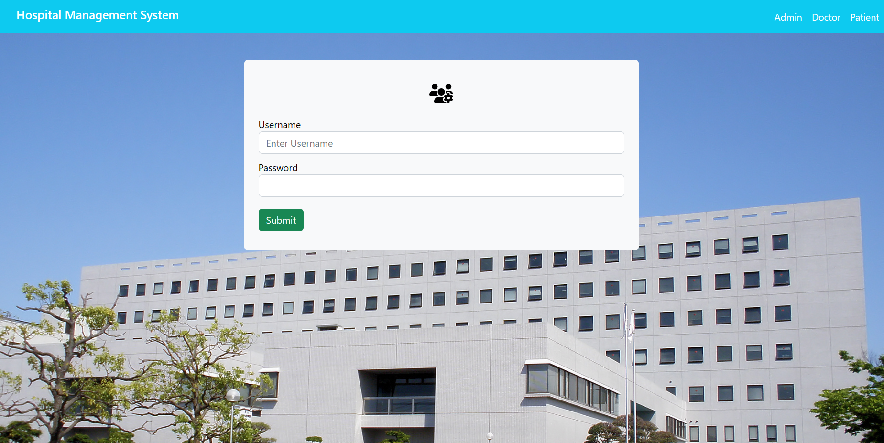

On clicking the ‘Login’ button, the admin will be redirected to his/her dashboard as shown in the following picture:

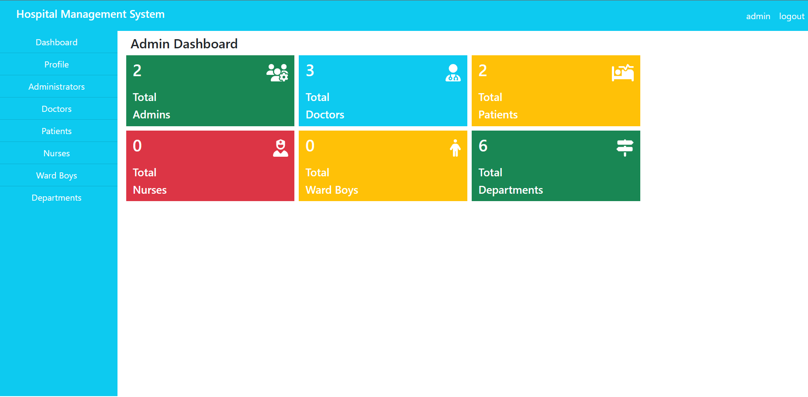

This module allows admin to perform five major operations:

**1. Update it's credentials:**

  &nbsp; &nbsp; &nbsp; Admin can change his username and password. 
  
  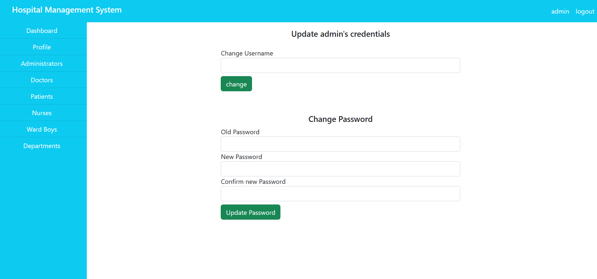
  

**2. View list of all other admins:**

  &nbsp; &nbsp; &nbsp; Admin can view all registered admins' info. 
  This includes the admins’ ID, Username. Admin can also delete them. 
  
  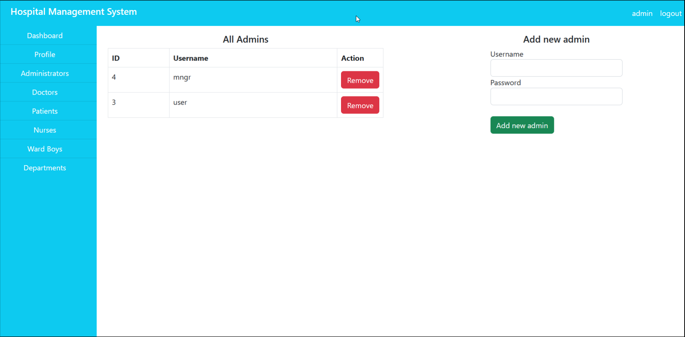

  
**3. View list of all registered doctors:**

  &nbsp; &nbsp; &nbsp; Details of the doctors can also be viewed by the admin and the ability to remove doctors.

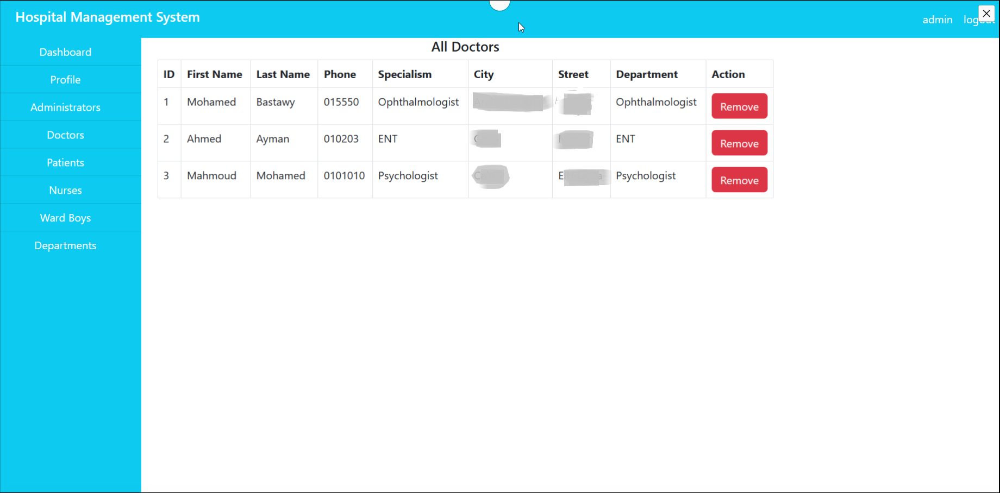

**4. View list of all  registered patients:**

  &nbsp; &nbsp; &nbsp; Admin can view all the patients registered. Admin can also remove patients.

  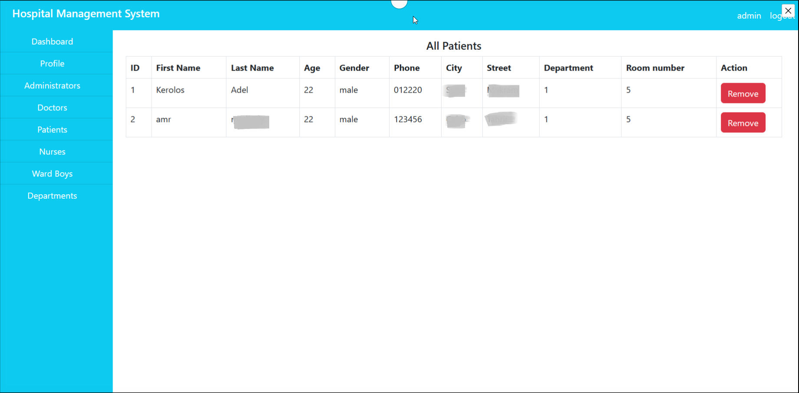

**5. View all existing departments:**

  &nbsp; &nbsp; &nbsp; Admin can see the entire details of the department and he can also add new department or delete existed one.
  
  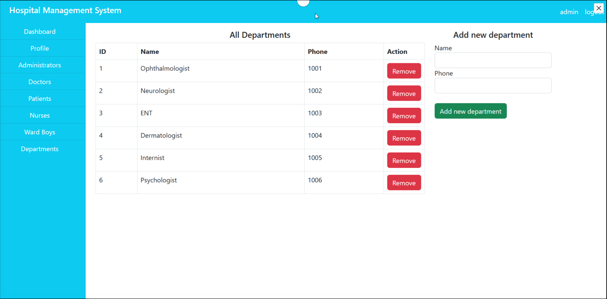
  

### Doctor Module:

  &nbsp; &nbsp; &nbsp; The doctors can login into their account which can be done by tapping 'Doctor' tab from home page. Doctor will be redirected to login screen.
  
  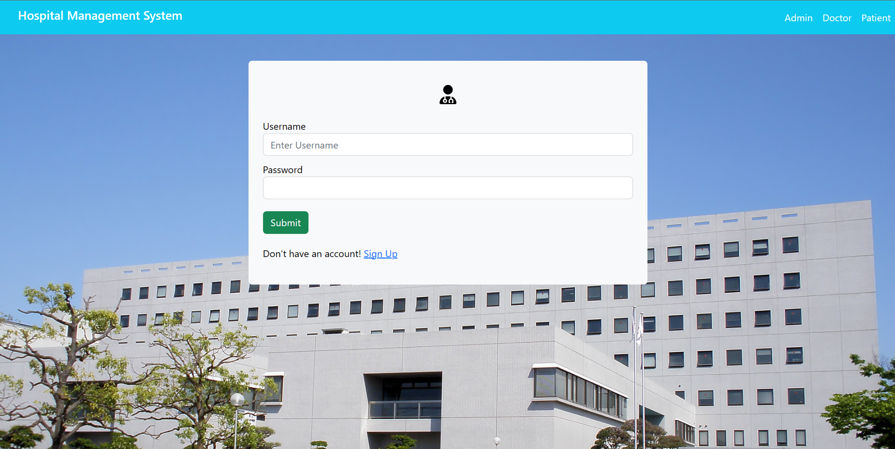

Once the doctor clicking the ‘Login’ button, they will be redirected to their own dashboard where he can see his information, patients and their appointments which has been booked.
  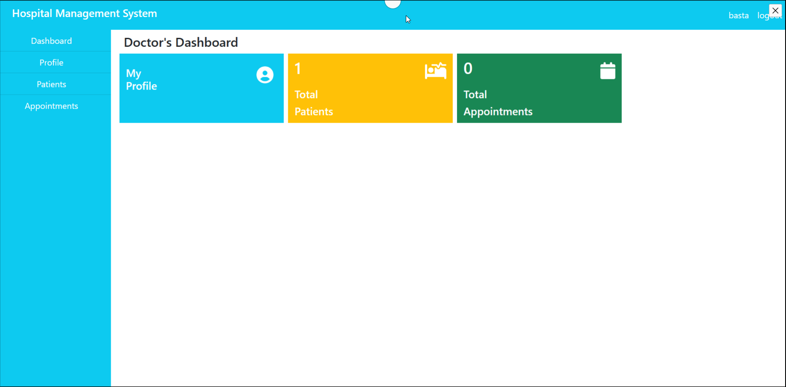

This module allows admin to perform five major operations:

**1. View his information and Update it's credentials:**

  &nbsp; &nbsp; &nbsp; Doctor view his information and he can change his username and password. 
  
  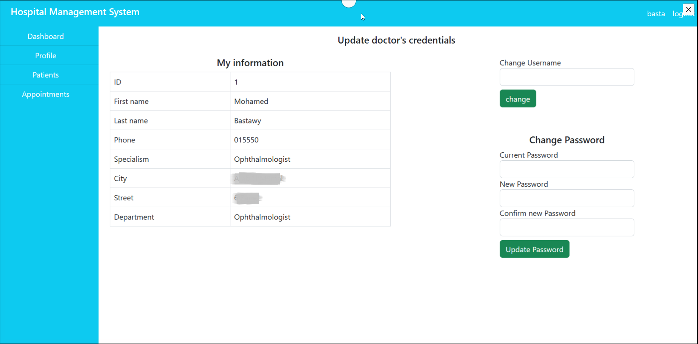
  

**2. View list of his patients:**

  &nbsp; &nbsp; &nbsp; Doctor can view all patients who register with him and their info. 
  He also can delete patient or add new one.
  
  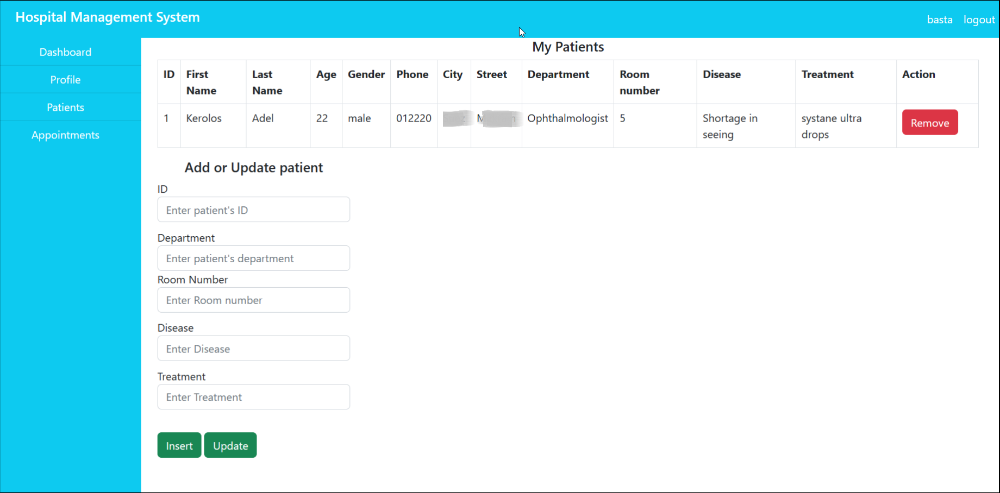

  
### Patient Module:

  &nbsp; &nbsp; &nbsp; This module allows patients to create their account.Once the patient has created his/her own account or login in to his existed account, he will be redirected to his/her Dashboard.

  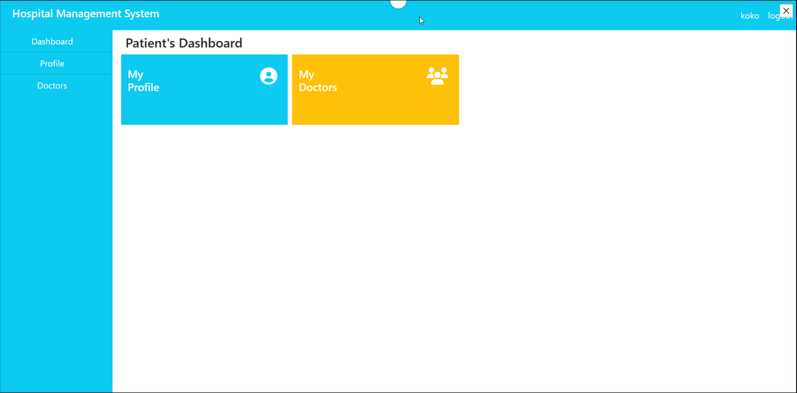

The Dashboard page allows patients to perform two operations:

**1. View info and Update it's credentials:**

  &nbsp; &nbsp; &nbsp; Here, the patients can change his username and password.
  
  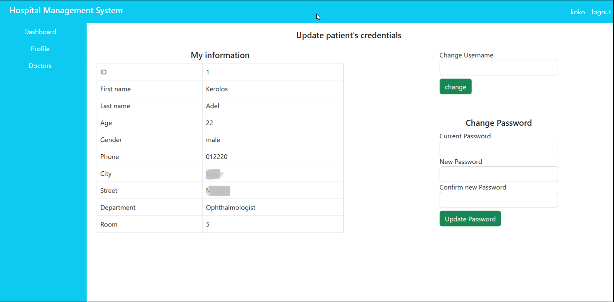

**2. View doctors who treats him:**

  &nbsp; &nbsp; &nbsp; Here, the patient can see doctors who treats him.

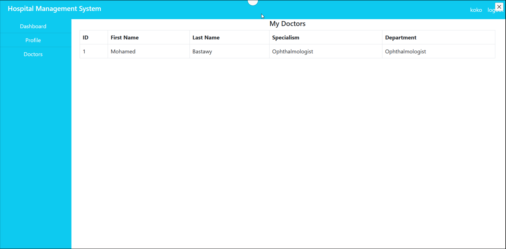
